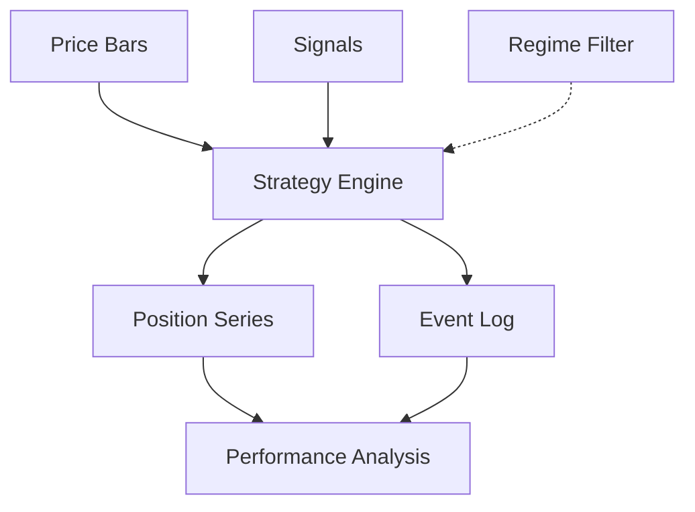

# Analysis & Reporting Scripts

# Analysis & Reporting Scripts Documentation

## Overview
The Analysis & Reporting Scripts module provides tools for backtesting and analyzing trading strategies, with a focus on the "opposite exit" pattern - where positions are closed when an opposing signal is received. The module handles data loading, strategy execution, performance analysis, and report generation.

## Key Components

### Strategy Engine
The core strategy engine is implemented in `run_imba_opposite_exit()`, which:

1. Takes price bars, trading signals, and optional regime filters as input
2. Maintains position state and processes signals
3. Executes entries on initial signals and exits on opposing signals
4. Generates detailed event logs for analysis



### Data Loading & Preprocessing
- `read_ohlcv_parquet()`: Loads and validates price bar data
- `read_fills_parquet()`: Loads actual fill prices for realistic backtesting
- `signals_bundle_to_df()`: Normalizes signal data from various input formats
- `load_external_regime_to_bricks()`: Loads regime filters (e.g., trading hours)

### Performance Analysis
Several components work together to analyze strategy performance:

- `pair_trades_from_events()`: Pairs entry/exit events into completed trades
- `compute_trade_pnl()`: Calculates per-trade P&L including fees
- `equity_from_trades()`: Generates equity curve
- `max_drawdown_pct()`: Calculates maximum drawdown
- `overlap_stats()`: Analyzes regime filter effectiveness
- `pnl_split_by_gate()`: Breaks down performance by regime periods

### Configuration
Strategy behavior is controlled through `OppParams`:
```python
@dataclass
class OppParams:
    fee_bps: float = 10.0  # Trading fees in basis points
    gate_mode: str = "entries_only"  # How regime filters are applied
```

## Usage

Basic usage from command line:
```bash
python imba_opposite_exit_backtest.py \
  --renko-parquet data/bars.parquet \
  --signals-jsonl signals.jsonl \
  --fee-bps 10.0
```

With optional regime filtering:
```bash
python imba_opposite_exit_backtest.py \
  --renko-parquet data/bars.parquet \
  --signals-jsonl signals.jsonl \
  --regime-csv trading_hours.csv \
  --gate-mode entries_only
```

## Output
The script generates a structured output directory containing:
- `stats.json`: Summary statistics and configuration
- `pos.parquet`: Full position time series
- `events.parquet`: Detailed event log
- `trades_real.parquet`: Completed trade records
- `equity_real.parquet`: Equity curve

## Integration Points
- Reads signals generated by strategy modules via `load_signals()`
- Can incorporate actual fill prices from execution systems
- Outputs standardized formats for downstream reporting tools

## Common Customizations
1. Adding new performance metrics:
   - Add calculation function
   - Include in stats dictionary in main()

2. Modifying exit logic:
   - Modify signal processing in run_imba_opposite_exit()
   - Update event logging accordingly

3. Adding regime filters:
   - Create new filter loading function
   - Add to gate logic in run_imba_opposite_exit()

## Error Handling
The module includes robust error handling for:
- Missing or malformed input files
- Data quality issues (missing timestamps, NaN prices)
- Configuration validation
- Runtime state consistency

## Performance Considerations
- Uses pandas merge_asof() for efficient time series alignment
- Minimizes DataFrame copies and transformations
- Processes events sequentially in a single pass