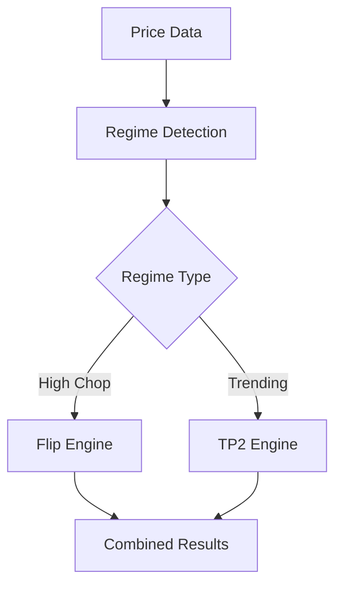

# Backtesting Engine — scripts

# Backtesting Engine Scripts

This module provides a collection of backtesting scripts for evaluating and analyzing trading strategies. The scripts support different types of backtests including multi-asset strategies, predictive coding models, and walk-forward analysis.

## Key Components

### Multi-Asset Backtester (backtest_multi_asset.py)

Tests a dual-strategy system that combines:
1. A countertrend "Flip Engine" strategy during high-chop/low-trend regimes
2. A trend-following "TP2" strategy during trending regimes



Key features:
- Regime detection using Choppiness Index, ADX, and Efficiency Ratio
- Renko brick construction for noise reduction
- IMBA signal generation for entry points
- Configurable take-profit and stop-loss levels
- Detailed performance statistics

### Predictive Coding Backtester (run_pc_backtest.py, run_pc_trade.py)

Tests strategies based on predictive coding models that learn price patterns:

- Supports both minute bars and Renko bricks
- Implements a temporal prediction model
- Uses learned patterns for trade decisions
- Tracks model uncertainty metrics
- Configurable model hyperparameters

### Walk-Forward Analysis (walk_forward_merged.py)

Provides robust out-of-sample testing through:

1. Standard walk-forward:
   - Fixed parameter sets
   - Rolling train/test windows
   - Out-of-sample performance metrics

2. Walk-forward optimization:
   - Parameter grid search on training data
   - Best parameters applied to test window
   - Prevents overfitting through proper validation

## Usage Examples

Multi-asset backtest:
```bash
python scripts/backtest_multi_asset.py --pair FETUSDT --box 0.0001 \
  --ttp-trail-pct 0.012 --min-sl-pct 0.015 --tp1-pct 0.04 --tp2-pct 0.08
```

Predictive coding backtest:
```bash
python scripts/run_pc_backtest.py --input data/BTCUSDT.parquet \
  --d-latent 32 --lr-x 0.05 --warmup-bars 200
```

Walk-forward analysis:
```bash
python scripts/walk_forward_merged.py --walk-forward \
  --parquet data/ETHUSDT.parquet --train-days 252 --test-days 63
```

## Key Functions

- `build_regime()`: Detects market regimes using technical indicators
- `run_backtest()`: Core backtesting logic for strategy evaluation
- `trade_metrics()`: Calculates performance statistics like returns, drawdown, Sharpe ratio
- `run_walk_forward()`: Implements walk-forward testing methodology
- `analysis_report()`: Generates detailed performance analysis reports

## Integration Points

The scripts integrate with other system components:

- Uses the `quant.features` module for technical indicators
- Interfaces with `quant.strategies` for trading logic
- Leverages `quant.predictive_coding` for ML models
- Outputs results in standardized formats for analysis tools

## Output and Analysis

All scripts produce standardized outputs including:

- Trade logs with entry/exit points
- Equity curves
- Performance metrics
- Parameter optimization results (for walk-forward)
- Regime classification results

Results are saved in parquet/CSV formats under `data/runs/<run_id>/` for further analysis.

## Best Practices

1. Always use the `--run-id` parameter to organize results
2. Start with small date ranges during development
3. Use walk-forward analysis for robust strategy validation
4. Monitor both combined and per-strategy metrics
5. Consider transaction costs in performance evaluation