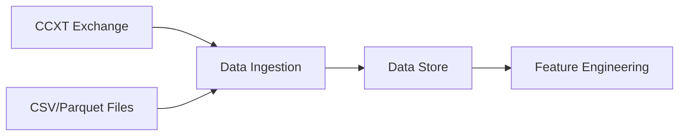

# Data Ingestion & Feature Engineering

# Data Ingestion & Feature Engineering Module

This module handles the ingestion of raw market data and computation of technical features used by trading strategies. It consists of several key components that work together to create a reliable data pipeline.

## Core Components

### 1. Data Ingestion

The module supports multiple data sources and formats:

- **CCXT Live Data** (`ccxt_fetch.py`): Fetches live OHLCV data from exchanges
- **CSV/Parquet Import** (`ingest_ohlcv_file.py`, `ingest_pipe_ohlcv.py`): Imports historical data from files
- **Data Store** (`store.py`): Manages consistent storage structure for market data



### 2. Data Cleaning

Several utilities ensure data quality:

- `clean_parquet_outliers.py`: Removes or repairs price anomalies using:
  - Rolling median deviation detection
  - Jump size thresholds
  - Range/spread checks
  - Stuck price detection

- `check_ts_integrity.py`: Validates timestamp consistency
- `check_parquet_anomalies.py`: Identifies potential data issues

### 3. Feature Engineering

The module computes several types of features:

#### Price Action Features
- **Renko Bars** (`renko.py`): 
  - Fixed box size or ATR-adaptive brick construction
  - Gap handling for session breaks
  - Supports both historical and real-time updates

#### Technical Indicators
- Relative Strength Index (RSI)
- Average Directional Index (ADX)
- Average True Range (ATR)
- Choppiness Index
- Efficiency Ratio
- Rolling Volume Analysis
- Trend Analysis (slope & R²)

#### Market State Features
- **Daily Gate** (`build_daily_gate_solusdt.py`):
  - Walk-forward threshold computation
  - Hysteresis-based state transitions
  - Multi-indicator composite signals

## Key Features

### Data Quality
- Robust timestamp handling across timezones
- Duplicate detection and removal
- OHLC invariant enforcement
- Missing data detection
- Outlier identification and cleaning

### Performance
- Efficient Pandas operations
- Incremental processing support
- Parquet storage for fast I/O

### Flexibility
- Multiple data source support
- Configurable parameters
- Modular design for adding new features

## Usage Examples

### Basic Data Import
```python
from quant.data.ccxt_fetch import fetch_ohlcv
from quant.data.store import save_parquet

# Fetch live data
df = fetch_ohlcv("binance", "SOL/USDT", "1m", limit=500)

# Save to canonical store
save_parquet(df, "data/raw", "binance", "SOL-USDT", "1m", "latest.parquet")
```

### Feature Computation
```python
from quant.features.renko import renko_from_close

# Create Renko bars
renko_df = renko_from_close(ohlcv_df, box=0.1)

# Compute daily features
from scripts.build_daily_features import rsi, atr, efficiency_ratio

df["RSI"] = rsi(df["close"], length=14)
df["ATR_PCT"] = atr(df["high"], df["low"], df["close"]) / df["close"]
df["ER"] = efficiency_ratio(df["close"], length=120)
```

## Integration Points

- Provides cleaned data for backtesting engines
- Feeds feature vectors to trading strategies
- Supports both historical analysis and live trading
- Interfaces with monitoring and alerting systems

## Best Practices

1. Always validate input data quality
2. Use appropriate window sizes for rolling computations
3. Handle edge cases (first bar, missing data)
4. Maintain timezone consistency (UTC)
5. Document feature parameters and assumptions

## Dependencies

- pandas: Data manipulation
- numpy: Numerical computations
- ccxt: Exchange connectivity
- pyarrow: Parquet I/O

This module forms the foundation for reliable trading strategy development by ensuring clean data and meaningful features are available to downstream components.