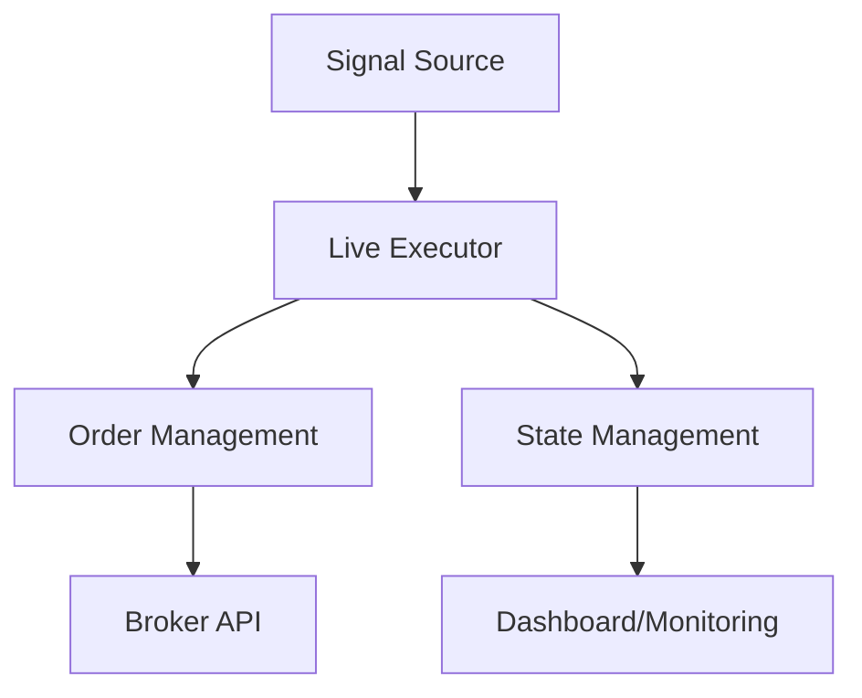

# Live Execution & Broker Integration — quant

# Live Execution & Broker Integration

This module implements live trading execution, broker integration, and real-time state management for algorithmic trading strategies. It provides a robust framework for executing trades, managing positions, and monitoring execution state across multiple brokers.

## Core Components

### Broker Integration

The module supports multiple brokers through standardized interfaces:

- **KucoinFuturesBroker**: Implementation for KuCoin Futures API
- **KrakenFuturesClient**: Implementation for Kraken Futures API 

Both implementations handle:
- Authentication and request signing
- Position management
- Order placement and execution
- Account balance queries
- Market data access

### Execution State Management

The execution state is managed through several key components:

1. **Live Executor** (`live_executor.py`):
   - Maintains execution state and handles state transitions
   - Processes signals and generates trading actions
   - Implements safety checks and position verification
   - Manages position sizing based on account equity

2. **Order Management System** (`oms.py`):
   - Implements order execution strategies (maker-first, taker fallback)
   - Handles order lifecycle (placement, monitoring, cancellation)
   - Provides retry logic and error handling

3. **Dashboard State** (`dashboard_state.py`):
   - Tracks and persists execution metrics
   - Manages trading diary and fill history
   - Provides real-time state for monitoring UI



## Key Features

### Position Management

- **Smart Sizing**: Computes position sizes based on:
  - Account equity
  - Leverage settings
  - Risk parameters
  - Contract multipliers

```python
def compute_target_size(equity_usd: float, mark_price: float, leverage: float, equity_pct: float) -> float:
    if mark_price <= 0 or equity_usd <= 0:
        return 0.0
    notional = equity_usd * equity_pct * leverage
    return notional / mark_price
```

### Safety Features

1. **Fill Verification**:
   - Verifies executed positions match intended targets
   - Monitors fill ratios and raises alerts on deviations
   - Implements cooldown periods between actions

2. **State Consistency**:
   - Persists execution state to survive restarts
   - Implements idempotent signal processing
   - Maintains audit trails of actions and fills

### Monitoring & Diagnostics

The module provides comprehensive monitoring through:

1. **Trading Diary**: 
   - Tracks all trades with entry/exit details
   - Computes running P&L metrics
   - Maintains fill history

2. **State Space Monitoring**:
   - Tracks regime metrics and state transitions
   - Provides real-time market state visualization
   - Monitors execution quality metrics

## Configuration

The module is highly configurable through environment variables:

```python
# Core settings
LIVE_EXECUTOR_LEVERAGE="1"
LIVE_FLIP_TTP_TRAIL_PCT="0.012"
LIVE_FLIP_MIN_SL_PCT="0.015"

# Broker settings  
KUCOIN_FUTURES_API_KEY="..."
KUCOIN_FUTURES_API_SECRET="..."
KRAKEN_FUTURES_KEY="..."
```

## Usage Example

```python
# Initialize broker
broker = KucoinFuturesBroker()

# Configure execution parameters
params = FlipParams(
    ttp_trail_pct=0.012,
    min_sl_pct=0.015,
    max_sl_pct=0.030
)

# Run execution loop
state = ExecutorState()
while True:
    state = run_once(
        broker=broker,
        state=state,
        params=params
    )
```

## Integration Points

The module integrates with:

- **Signal Generation**: Consumes trading signals from strategy modules
- **Risk Management**: Implements position sizing and risk controls
- **Monitoring**: Provides state for dashboard/monitoring UIs
- **Regime Detection**: Consumes regime state for execution gating

## Error Handling

The module implements comprehensive error handling:

1. **Broker API Errors**:
   - Retries with exponential backoff
   - Maintains operation under degraded conditions
   - Logs errors with appropriate severity

2. **State Recovery**:
   - Persists critical state to disk
   - Implements recovery procedures
   - Maintains audit trails for debugging

## Best Practices

When working with this module:

1. Always use the OMS layer rather than direct broker calls
2. Implement proper error handling and logging
3. Monitor execution metrics and fill ratios
4. Test changes in dry-run mode first
5. Maintain idempotency in signal processing

This module is critical for live trading operations - changes should be thoroughly tested and deployed with caution.