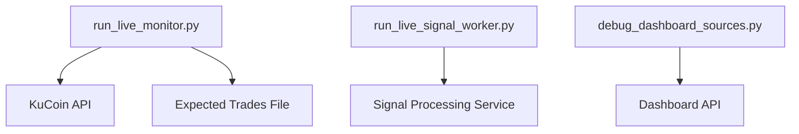

# Live Execution & Broker Integration — scripts

# Live Execution Scripts Documentation

## Overview
This module contains command-line tools for monitoring and managing live trading execution. The scripts provide essential functionality for:
- Comparing expected vs actual trades
- Running live signal processing
- Debugging dashboard data sources

## Key Components

### Trade Monitor (`run_live_monitor.py`)
The primary tool for reconciling expected trades against actual exchange fills.

```bash
# Example usage
./run_live_monitor.py --symbol SOL-USDT --window-sec 180 --limit 500
```

Key features:
- Loads expected trades from `data/live/expected_trades.jsonl`
- Fetches actual fills from KuCoin API
- Matches expected and actual trades within a configurable time window
- Generates slippage and PnL difference reports
- Optional CSV export of matched trades

Configuration options:
- `--symbol`: Trading pair to monitor (default: SOL-USDT)
- `--window-sec`: Time window for matching trades (default: 120s)
- `--limit`: Maximum fills to fetch from exchange (default: 200)
- `--expected-dir`: Custom directory for expected trades
- `--out`: CSV output path for detailed reports

### Signal Worker (`run_live_signal_worker.py`)
Entry point for the live signal processing service. This script delegates to the main signal worker implementation in `quant.execution.live_signal_worker`.

### Dashboard Diagnostics (`debug_dashboard_sources.py`)
Diagnostic tool for troubleshooting dashboard data sources. Fetches and analyzes data from:
- Trade markers
- Renko bars
- Position levels
- Equity curves
- Trading diary entries

```bash
# Example usage
./debug_dashboard_sources.py https://your-dashboard-url.railway.app
```

The tool logs detailed diagnostic information including:
- Fill and trade count reconciliation
- Renko bar timeline analysis
- Marker timestamp verification
- Level and entry point validation
- Diary and equity data verification

## Integration Points



## Common Workflows

### Trade Reconciliation
1. Execute trades through the system, which records expected trades
2. Run `run_live_monitor.py` to compare with actual fills
3. Review slippage and execution quality metrics
4. Export detailed report if needed

### Dashboard Troubleshooting
1. Identify dashboard data inconsistency
2. Run `debug_dashboard_sources.py` with dashboard URL
3. Review diagnostic logs for data source issues
4. Check marker timestamps and data counts

## Error Handling
- Scripts include appropriate error handling for API failures
- Clear error messages for missing expected trades
- Timeout handling for API requests
- Validation of input parameters

## Dependencies
- Requires KuCoin API credentials configured
- Expects `data/live` directory structure
- Relies on `quant.execution` package components

## Best Practices
- Run trade monitor regularly during active trading
- Keep expected trade files organized by date
- Monitor diagnostic logs for anomalies
- Set appropriate time windows based on trading frequency