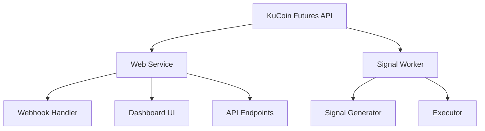

# Other — docs

# Documentation: Deployment & Operations Guide

This module provides comprehensive documentation for deploying and operating the quantitative trading system, with a focus on cloud deployment, live operations, and state space analysis.

## Core Components

### 1. Live Operations & Cloud Deployment

The system is designed to run as a set of services:

- **Web Service**: Handles webhooks, provides dashboard UI, and serves API endpoints
- **Signal Worker**: Generates trading signals and manages execution
- **Dashboard**: Web-based monitoring interface

### 2. Railway Deployment

The system is primarily deployed on Railway with two main services:

1. **quant service**
   - Serves web dashboard and APIs
   - Handles webhook requests
   - Reads dashboard state files

2. **Signal service**
   - Runs signal generation
   - Manages trade execution
   - Writes state files

Key configuration includes:
- Environment variables for API keys and trading parameters
- Volume mounts for persistent storage
- Health monitoring endpoints

### 3. State Space Analysis

The system includes tools for analyzing market state transitions:

- 3-dimensional state space representation (X_raw, Y_res, Z_res)
- Voxelization for discrete state modeling
- Transition probability analysis
- Basin identification and analysis

## Key Features

### Live Trading Controls

- **Safety Controls**
  - `LIVE_TRADING_ENABLED` master switch
  - `LIVE_EXECUTOR_DRY_RUN` for simulation mode
  - Position and leverage limits
  - Symbol allowlist

### Dashboard Capabilities

- Real-time Renko chart visualization
- Gate state overlay
- Trade markers and PnL visualization
- Live level indicators (SL, TTP, TP)
- Auto-refresh and health monitoring

### Data Persistence

- Signal storage in JSONL files
- State files for execution and trailing
- Regime database
- Dashboard data files (Renko, trades, levels)

## Operations Guide

### Deployment Process

1. Configure Railway project with GitHub repository
2. Set required environment variables
3. Deploy web and signal services
4. Configure volumes for persistence
5. Verify health endpoints

### Go-Live Procedure

1. Start in dry-run mode
2. Verify signal generation and simulated executions
3. Enable live trading (`LIVE_TRADING_ENABLED=1`)
4. Disable dry-run (`LIVE_EXECUTOR_DRY_RUN=0`)
5. Monitor initial trades with conservative risk settings

### Monitoring & Maintenance

- Regular health checks via API endpoints
- Log monitoring for signal and execution status
- Dashboard freshness verification
- State file consistency checks

## Configuration Reference

The documentation includes comprehensive configuration references for:
- Environment variables
- File paths and persistence
- Trading parameters
- Dashboard refresh settings
- Logging controls

## Troubleshooting

Common issues and solutions are documented, including:
- Stale dashboard data checks
- Signal file verification
- Manual position flattening
- Railway-specific debugging tips

## Future Improvements

Documented next steps include:
- Unified runtime storage
- Enhanced level propagation
- Operations hardening
- Visualization improvements
- Go-live guardrail refinements

This documentation serves as both a deployment guide and an operations manual, ensuring reliable system operation and maintenance.