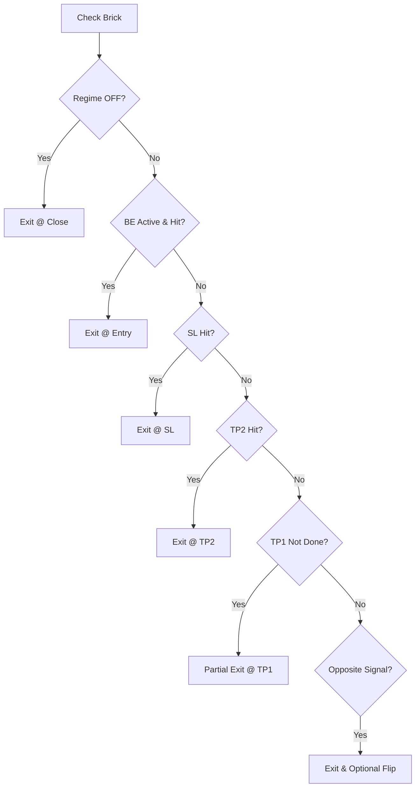

# Other — notebooks

# Quantitative Trading Session Notes Documentation

This document contains research notes from a quantitative trading session focused on developing an OFF-regime trading strategy for SOL-USDT pairs.

## Overview

These notes document the development of a complementary OFF-regime trading strategy that shares infrastructure with an existing ON-regime counter-trading system. The key focus is on implementing a different exit logic while using the same gating mechanism.

## Key Components

### Signal Processing
- Uses identical IMBA signals as the ON-regime strategy
- Signals are mapped to Renko bricks using `searchsorted`
- One signal event maximum per brick (last signal wins if multiple exist)
- Primary signal file: `imba_TV_5m_sens200_from1m.jsonl`

### Trade Logic Implementation

The strategy follows this hierarchical exit logic per brick:

### Key Parameters
- Trade Entry: Requires active gate (`gate_on == 1`) and signal event
- TP1: Partial exit with fraction parameter (`tp1_frac`)
- TP2: Complete exit of remaining position
- Break-Even (BE): Activates after TP1, exits at entry price
- Stop Loss (SL): Dynamic, based on swing extremes with min/max bounds

## Implementation Details

### Output Structure
- Trades are tracked via `trade_id`
- Each trade can have multiple legs (partial exits)
- Output files:
  - `legs.parquet`/`legs_real.parquet`: Individual exit legs
  - `trades.parquet`/`trades_real.parquet`: Aggregated trade data

### Fee Handling
- Single roundtrip fee per trade
- Strategy shows robustness across fee ranges (8-25 bps)

## Performance Characteristics

Sample configuration results:
- Parameters:
  - TP1: 4% with 50% position exit
  - TP2: 8%
  - SL: 3-8% range
- Performance metrics:
  - ~46% win rate
  - ~0.585% mean return per trade
  - Balanced distribution without heavy reliance on outliers

## Integration Points

- Uses same gate infrastructure as ON-regime strategy
- Gate files:
  - ON regime: `..._daily.csv`
  - OFF regime: `..._daily_OFF.csv`
- Gate activation rate: ~55% for OFF strategy

## Future Development

Priority tasks:
1. Parameter optimization for TP1/TP2 levels
2. Fee sensitivity analysis
3. Position sizing optimization (`tp1_frac`)
4. Optional features:
   - Flip trade functionality
   - Gate timing refinements

## Notes for Developers

When working with this module:
- Ensure signal file consistency between ON and OFF regimes
- Validate brick alignment when processing signals
- Consider fee impact when testing parameter changes
- Monitor trade density through `brick_events_in_gate` metric