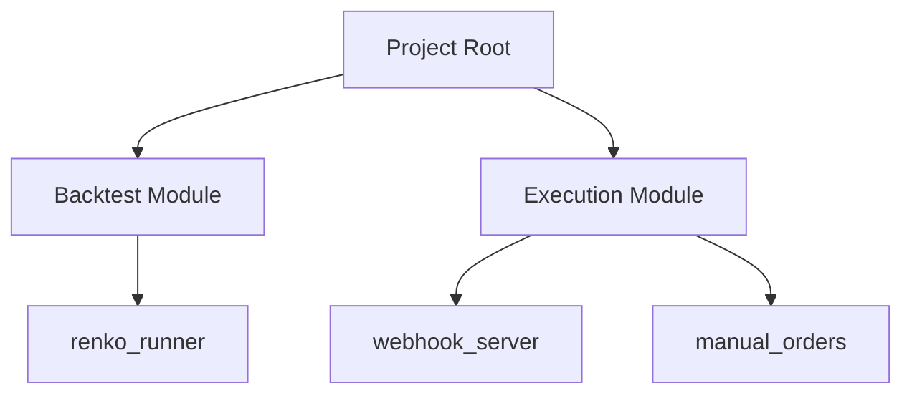

# Other — pyproject.toml

# Project Configuration Guide

This document describes the core configuration for the `quant` project - a cryptocurrency futures quantitative research and execution platform.

## Overview

The `pyproject.toml` file serves as the central configuration for the project, defining package metadata, dependencies, and command-line entry points. The project is designed to support both backtesting and live trading operations.

## Project Metadata

```toml
name = "quant"
version = "0.1.0"
description = "Crypto futures quant research + execution stack"
requires-python = ">=3.9"
```

The project requires Python 3.9 or higher, which ensures access to modern Python features while maintaining broad compatibility.

## Dependencies

The project relies on several key libraries:

### Data Processing & Analysis
- `pandas >= 2.0` - Data manipulation and analysis
- `numpy >= 1.24` - Numerical computations
- `pyarrow >= 12.0` - Efficient data serialization and storage

### Application Framework
- `pydantic >= 2.0` - Data validation and settings management
- `fastapi >= 0.110` - API framework for webhook endpoints
- `uvicorn >= 0.27` - ASGI server for FastAPI

### Development Tools
- `python-dotenv >= 1.0` - Environment variable management
- `loguru >= 0.7` - Logging functionality
- `rich >= 13.0` - Rich text and formatting in terminal

## Command-Line Tools

The project exposes three main entry points:

1. **Backtesting**
   ```bash
   quant-backtest
   ```
   Entry point: `quant.backtest.renko_runner:main`
   Used for historical strategy testing with Renko charts

2. **Webhook Server**
   ```bash
   quant-webhook
   ```
   Entry point: `quant.execution.webhook_server:main`
   Handles incoming trading signals and executes orders

3. **Manual Order Management**
   ```bash
   quant-manual-order
   ```
   Entry point: `quant.execution.manual_orders:main`
   Provides CLI interface for manual order submission

## Project Structure



The project is organized into two main modules:
- `backtest`: Contains strategy testing infrastructure
- `execution`: Handles order execution and trading operations

## Usage

To install the project and its dependencies:

```bash
pip install -e .
```

This will make all command-line tools available in your environment.

## Version Control Notes

When updating dependencies, ensure to test compatibility across all modules as the project has interdependent components that may be sensitive to version changes.