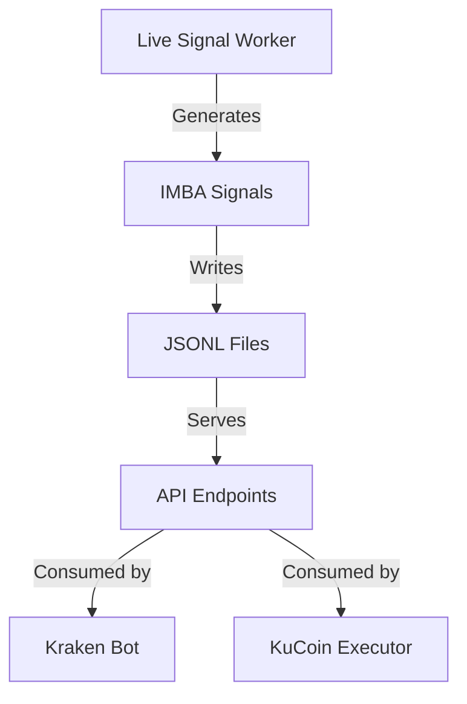

# Other — walkthrough.md

# Live Trading System Documentation

## Overview

This document provides a comprehensive guide to the live trading system's data flow and execution paths. The system consists of two parallel trading services (`quant` and `kraken`) that consume signals from a central signal generation pipeline.

## System Architecture



## Core Components

### 1. Signal Generation Pipeline

The signal generation process runs in the `live_signal_worker.py` module and follows these steps:

1. Fetches 1-minute candles from KuCoin
2. Converts candles to Renko bars
3. Computes IMBA signals using the strategy logic
4. Writes signals to date-stamped JSONL files

Key files:
- `src/quant/execution/live_signal_worker.py`
- `src/quant/strategies/imba.py`

### 2. API Layer

The API layer (`webhook_server.py`) exposes three critical endpoints:

- `/api/signals/latest/solusd` - Latest trading signal
- `/api/gate/solusd` - Active exit engine configuration
- `/api/renko/latest/solusd` - Renko bar data for stop-loss calculations

### 3. Execution Services

#### Kraken Service
- Maintains state in `bot_state.json`
- Uses a state machine for position management
- Handles signal-based entries and exits
- Supports multiple exit modes (flip/tp2)

#### KuCoin Service  
- Runs parallel to Kraken service
- Consumes same signal stream
- Maintains independent state

## State Management

### Critical State Files

```
SIGNALS_DIR/
├── SOL-USDT/
│   ├── YYYYMMDD.jsonl
│   ├── countertrend/
│   └── trendfollower/
├── live_signal_state.json
└── bot_state.json
```

### State Synchronization
The system relies on state files for position tracking. Manual interventions can cause state desynchronization, leading to unexpected behavior.

## Common Issues & Troubleshooting

### 1. Missing Signal Updates
If no new signals appear:
- Check if market conditions warrant a signal change
- Verify signal worker logs for calculation timestamps
- Remember signals are "sticky" by design

### 2. Position Mismatches
When manual trades cause issues:
- Bot state may be out of sync with exchange
- Use state reconciliation endpoints
- Consider pausing bot during manual intervention

## Operational Guidelines

### Pre-Trade Checklist
1. Verify signal freshness via API
2. Confirm gate configuration
3. Check Renko swing values
4. Review bot mode/action logs
5. Reconcile state after manual trades

### Monitoring Points
- Signal timestamp freshness
- State file consistency
- Exchange position alignment
- Action execution logs

## Development Notes

### Adding New Features
- Add regression tests for state machine paths
- Include debug logging for action decisions
- Maintain state reconciliation logic
- Document state machine transitions

### Testing
Key test areas:
- State machine transitions
- Manual intervention recovery
- Exit mode behavior
- Signal processing logic

## Future Improvements

1. Automated state reconciliation
2. Enhanced logging for decision points
3. Manual trade guardrails
4. Unified exit behavior across modes
5. State machine visualization tools