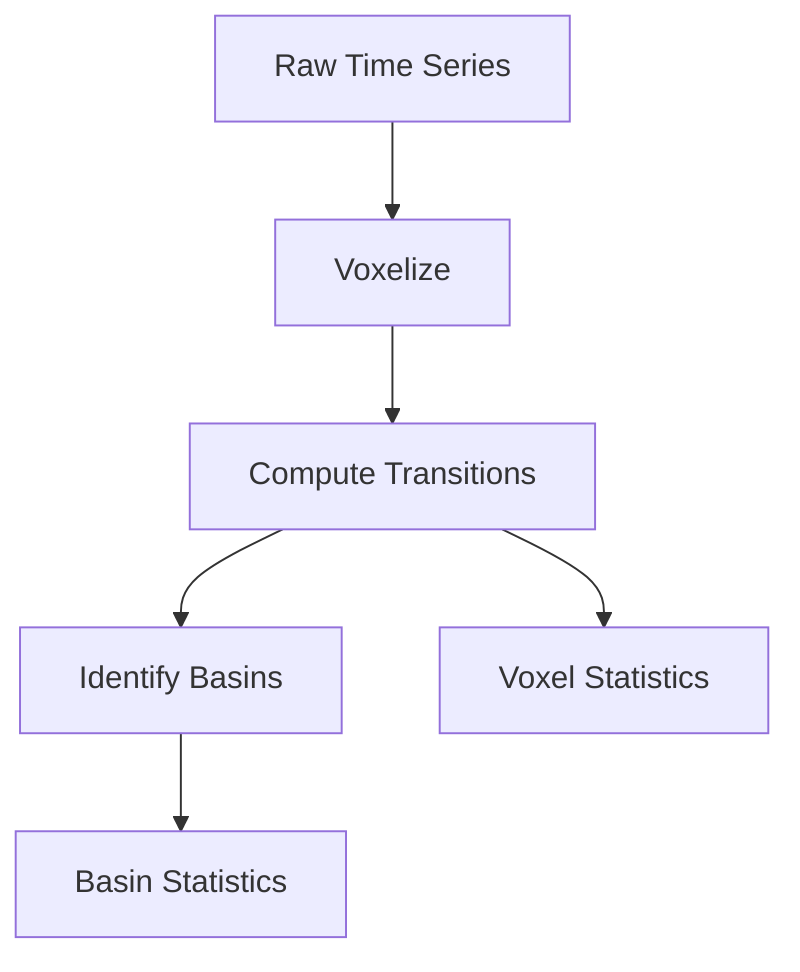

# State Space Transitions

# State Space Transitions Module

## Overview

The State Space Transitions module analyzes time series data by discretizing a 3D state space into voxels and computing transition probabilities between states. It identifies key regions (basins) where the system tends to spend time and characterizes the dynamics between these regions.

## Core Concepts

### Voxels
- The 3D state space is divided into a grid of voxels using either quantile-based or uniform binning
- Each data point is assigned to a voxel based on its (x,y,z) coordinates
- Voxels are identified by integer coordinates (ix,iy,iz) and a unique voxel_id

### Transitions
- Transitions between voxels are tracked as the system moves through state space
- Each transition has an associated probability and can be weighted by recency using decay_halflife_bars
- The top-k most likely transitions from each voxel are retained

### Basins
- Basins are collections of high-occupancy voxels that represent important regions of state space
- Basin assignments help reduce dimensionality by grouping related voxels
- Basin-to-basin transition probabilities provide a coarser view of system dynamics



## Key Components

### Configuration (TransitionConfig)
Controls key parameters including:
- n_bins: Number of bins per dimension (default 40)
- topk: Number of top transitions to retain per voxel (default 20)
- axes: Names of the x,y,z columns to analyze
- decay_halflife_bars: Optional exponential decay for weighting recent transitions

### Pipeline
The main processing pipeline:
1. Voxelizes input data
2. Computes transition counts and probabilities
3. Identifies basins and basin transitions
4. Calculates statistics at voxel and basin levels

### Statistics
For each voxel and basin, computes:
- Occupancy and transition probabilities
- Entropy of outgoing transitions
- Mean drift vectors and speed
- Persistence (self-transition probability)
- Center coordinates

## Usage

```python
from quant.state_space_transitions import TransitionConfig, run_pipeline

# Configure analysis
cfg = TransitionConfig(
    n_bins=40,
    topk=20,
    axes=["X_raw", "Y_res", "Z_res"]
)

# Run pipeline
results = run_pipeline(
    df=input_df,  # Must contain ts column and specified axes
    cfg=cfg,
    out_dir="output/path",
    basin_k=30  # Number of basins to identify
)
```

## Outputs

The pipeline writes several Parquet files:
- df_with_voxels.parquet: Original data with voxel assignments
- edges_counts.parquet: Raw transition counts between voxels
- transitions_topk.parquet: Top-k transitions per voxel
- voxel_stats.parquet: Statistics for each voxel
- basin_*.parquet: Basin assignments and statistics

## Integration Points

- Input: Takes time series data with timestamps and 3D coordinates
- Output: Produces detailed transition analysis files used by downstream visualization and analysis tools
- Configuration: Flexible parameters allow tuning for different use cases

## Performance Considerations

- Uses NumPy for efficient array operations
- Sparse representation of transitions (only storing non-zero counts)
- Optional time decay to focus on recent dynamics
- Configurable bin count to trade off resolution vs memory usage

## Common Use Cases

1. Analyzing system dynamics in 3D state spaces
2. Identifying stable regions and transition patterns
3. Reducing high-dimensional dynamics to basin transitions
4. Characterizing drift and diffusion in state space