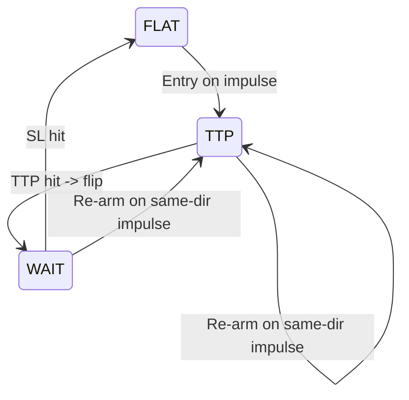

# Trading Strategies

# Trading Strategies Module Documentation

## Overview

The Trading Strategies module provides a collection of algorithmic trading strategies and supporting infrastructure. The core components are:

1. The IMBA signal generator - A trend-following strategy based on Fibonacci levels
2. The Flip Engine - A state machine that executes counter-trend trading logic
3. Signal I/O utilities - Tools for reading/writing trading signals in standardized formats

## IMBA Strategy

The IMBA strategy generates entry/exit signals based on price action relative to Fibonacci retracement levels.

### Key Components

```python
@dataclass
class ImbaParams:
    lookback: int = 240        # Period for calculating high/low range
    fib_236: float = 0.236    # Fibonacci levels used to define
    fib_5: float = 0.5        # trading zones
    fib_786: float = 0.786
    fixed_sl_abs: float = 1.5  # Absolute stop loss distance
```

### Signal Logic

- Calculates a price range using highest high and lowest low over lookback period
- Defines Fibonacci retracement levels within this range
- Long signals trigger when price is above both fib_5 and fib_236 levels
- Short signals trigger when price is below both fib_5 and fib_786 levels
- Signals are "sticky" - they persist until an opposing signal occurs

## Flip Engine

The Flip Engine implements a counter-trend trading strategy with sophisticated state management.

### States and Transitions



### Key Features

- Two-phase stop management:
  1. TTP (Trailing Take Profit) phase after entry
  2. WAIT phase with swing-based stops after TTP hit
- Regime filtering capability
- Detailed event logging for analysis
- Position state tracking

## Signal I/O

The module provides standardized signal input/output functionality:

- JSONL format for signal storage
- Flexible timestamp parsing
- Signal normalization to {-1, 0, +1}
- Support for both position and action-based signals

### Example Signal Format

```json
{
  "ts": "2024-01-01T00:00:00Z",
  "signal": 1,
  "position": 1,
  "source": "imba",
  "sl": 50000.0
}
```

## Integration Points

- Live execution systems consume signals via `signal_io.read_signals_jsonl()`
- Backtesting frameworks use `run_flip_state_machine()` for strategy simulation
- Signal generation scripts output to standardized JSONL format
- Analysis tools can load and process signals using common I/O utilities

## Usage Examples

Generate IMBA signals:
```python
params = ImbaParams(lookback=240)
signals = compute_imba_signals(bars_df, params)
```

Run the Flip Engine:
```python
params = FlipParams(ttp_trail_pct=0.012)
pos_series, events, state = run_flip_state_machine(
    bars=bars_df,
    signals_df=signals_df,
    params=params
)
```